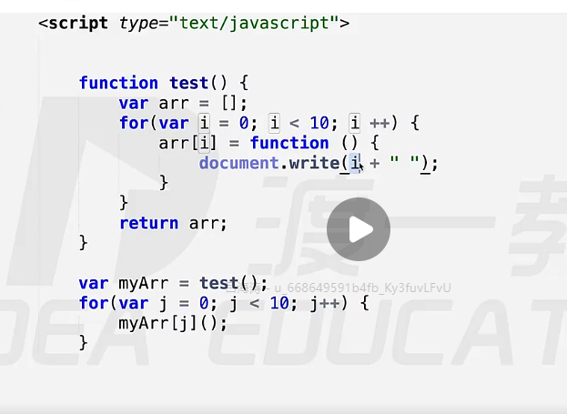
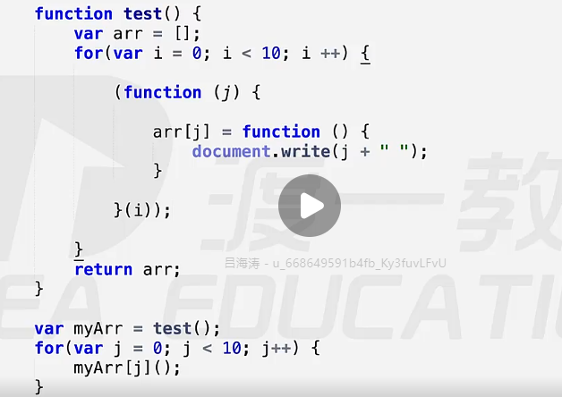

# 主流浏览器

| Name    | Kernel  |
| ------- | ------- |
| IE      | trident |
| Chrome  | blink   |
| FireFox | Gecko   |
| Opera   | Presto  |
| Safari  | webkit  |

# 程序语言的翻译方式

- 编译 compile -> c, c++
  
  - 优点：快
  
  - 难以跨平台

- 解释 Interpretation - javascript, php, python,
  
  - 速度慢
  
  - 跨平台

- Java 
  
  - .java -> javac -> compile -> .class -> run in JVM虚拟机 ->解释执行

- javascript 是单线程语言

- synchronize: 一次干一件事情

- asynchronize: 同时干多件事，异步代表同时执行
  
  - link tag

- ECMA指定标准

- javascript
  
  - DoM
  
  - BOM:操作浏览器
  
  - 轮转时间片： 任务被切分很小的任务

- 结构，样式，行为相分离

# JS基本语法

## 变量 variable

- 声明：var a;

- 赋值：a = 100;

- 英文字母，下划线，$$

## 数据类型

- 原始值 - 放在stack
  
  - Number
  
  - Boolean
  
  - String
  
  - undefined
  
  - null

- 引用值： 数组，对象，函数，RegExp  - 存在堆heap

# 函数的 AO和GO ->作用域链

Activation Object     Global Object

- fun defined  - > GO

- fun 执行       -> 1:AO, 2:GO

- 内部的函数被返回到外部，必然产生闭包 

## 立即执行函数

```js
(function (){
    var a = 123;
    var b = 234;
}() )
```

- 只有表达式才能被执行符号执行

- 函数声明和函数表达式不同

- 能被执行符号执行的的函数表达式的函数名字会被忽略 - 等同于立即执行函数

- ```js
  //函数声明
  function test(){
      var a = 123;
  } （）；// 会报错不能执行
  
  //函数b表达式
  var test = function(){
      var a = 123;
  } ();//可以执行
  ```

- 当内部函数被保存到外部的时候，将会产生闭包问题。闭包的问题就要用闭包解决

- 里面的函数的生命周期比母函数长，造成内存泄漏。效率降低。



- 用立即执行函数解决上述的问题.思路是通过立即执行函数，让赋值给数据的函数产生各自的Active Object.



# 对象的创造方法

- var obj = {}

- constructor function
  
  - 系统自带的构造函数 new Object(), Numer, Array
  
  - 自定义

- 类采用大驼峰命名规则:单词首字母大写
