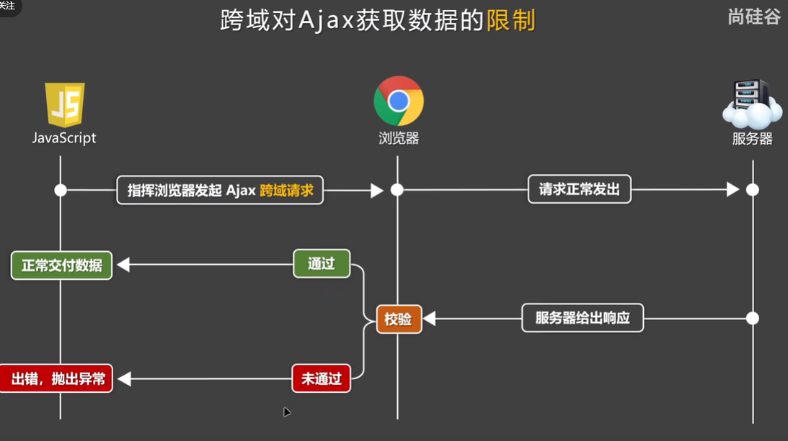

# token的理解与应用

- `JWT` 插件：Json Web Token,服务器利用此插件返回一个token给前段

- `token`是一个用户的唯一标识

- 登录成功后，服务器可以根据`token`确定对应的数据

- `token`有一定时间的限制

- token好比入职一个公司佩戴的工卡，离职后工卡就失效了

- `token`存储再pinia仓库中

# 进度条效果-插件nprogress

- nprogress.start()

- nprogress.done()

# Vue 数据绑定语法

- v-mode：可以使父子组件数据同步

# EL-Form表单校验

- 绑定`model`属性到指定数据存储源

- 再每个表单项设置`prop`属性指定需要校验的变量的名字，它来源于表单`form`绑定的数据源

- 添加和绑定`rules` 对象，它被定义为一个类，里面指定对每个变量的校验规则

- `rules`对象里的属性名字和`prop`相对应。

- { required: true, trigger:'blur' , validator:validatorTmName}
  
  - validator是自定义的函数，包含三个参数：rule,value,callBack

- `await`等待执行完成功的结果，通常返回`Promise`对象，如果不成功，后面的语句不执行

# 自定义组件嵌入div标签中

自定义的组件最好要包含在一个div标签中，否则会出现如下错误：

`TypeError: Cannot read properties of undefined (reading 'Vue')`

# 跨域问题与解决方案-Access-Control-Allow-Origin

## 浏览器对跨域的限制

- 跨域不能互相访问DOM元素

- Cookie访问限制，源A不能访问源B的cookie

- Ajax响应数据限制；允许你向目标发送Ajax请求，限制目标的response.

## 注意点

- 跨域问题仅存在与前端开发中

- 解决该问题，关键是如何处理`校验`

## CORS解决Ajax跨域问题

Cross-Origin Resource sharing, 前提是服务器是自己人，需要加入请求头信息

- 简单请求

- 复杂请求 

## JSONP解决跨域问题

他只能解决get的跨域问题 

## 配置代理解决跨域问题
