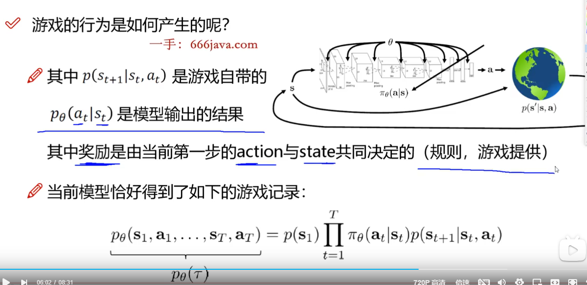
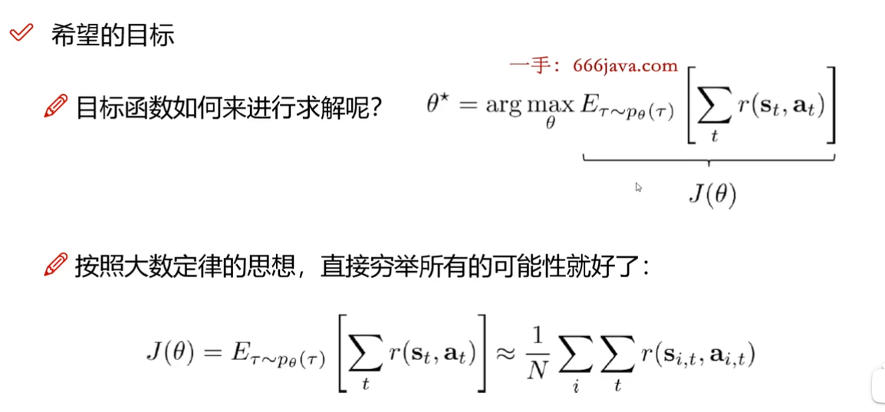
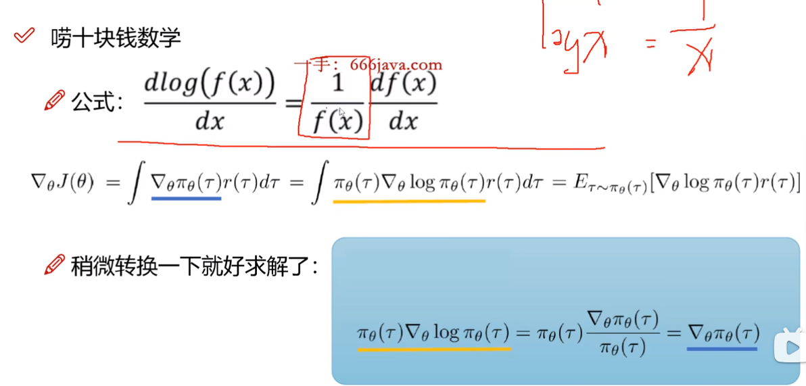
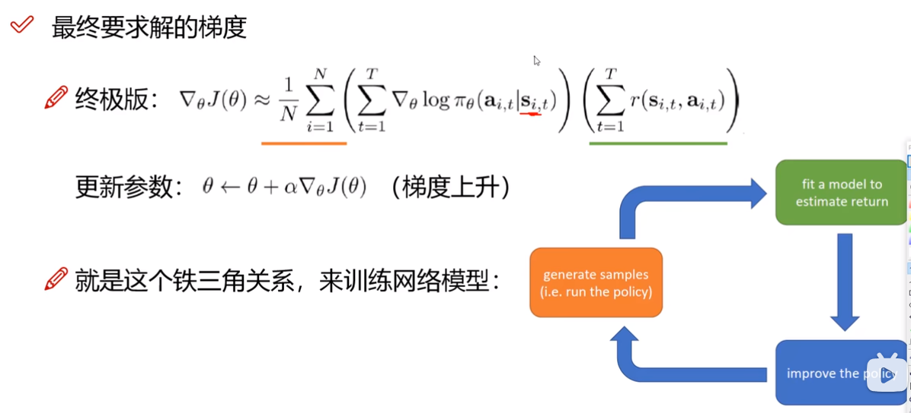

# 学习重点分布

| chapter         | 知识点                  | Target                                            |
| --------------- | -------------------- | ------------------------------------------------- |
| 自然语言处理概述        | 入门基础                 | 自然语言处理的基本流程                                       |
| 语句的切分-分词        | 分词的基本方法和原理           | 基于字典分词，基于统计分词，基于模型的分词bpe的原理和代码实现                  |
| 基于N-gram的浅层神经网络 | one-hot and Word2vec | 什么是word2vec, onehot编码？word2vec的作用和分类              |
|                 | CBOW模型               | CBOW的基本原理和代码                                      |
|                 | Skipgram模型           | 原理和代码                                             |
| 时序网络在NLP的应用     | RNN的基本原理和应用          | 原理，缺点，参数，代码                                       |
|                 | LSTM的基本原理            | 基本架构，参数，应用                                        |
| 预训练模型           | Transform            | 原理和缺陷                                             |
|                 | bert内功如何练成           | bert 预训练和注意力机制                                    |
|                 | bert的一招一式            | 使用bert进行文本分类，调用、训练和配置文件，和transform,huggingface的使用 |
|                 | 使用GPT完成文本生成任务        | gpt类的预训练；推理；训练聊天机器人                               |
|                 | 内外兼修T5模型             | T5模型的预训练和注意力机制，用T5做翻译                             |
| 文本分类算法          | textcnn算法实现文本分类      | 原理与实战                                             |
|                 | df-idf算法             | 原理与实战                                             |
| 文本匹配            | 通用文本匹配               | 语义相似度；使用word2vec匹配实战                              |
| 关键词提取算法         | textrank提取关键词        | 基本原理和使用                                           |
| 文本摘要算法          | 抽取式摘要技术              | 基于textrank文本摘要；基于句子向量聚类的文本摘要；句子级序列标注式摘要           |
| 知识图谱入门          | 图谱构造技术路线             | 介绍，基本构成，图谱构造路线                                    |

# 实战进阶

| Chapter         | DESC              | Target                                                     |
| --------------- | ----------------- | ---------------------------------------------------------- |
| 基于N-gram的浅层神经网络 | 怎样提高word2vec的训练速度 | CBOW的加速原理和代码实战                                             |
| Transform       | 代码精讲解             | 代码                                                         |
| Bert高阶          | 如果样本不平衡           | 分类不平衡问题                                                    |
|                 | 如何实现命名实体识别        | 用bert进行序列标注crf的基本原理                                        |
|                 | 语言的阵营：对立，中立，同盟    | 使用bert进行文本蕴含任务                                             |
|                 | 从头训练bert          |                                                            |
| bert的变身         | roberta           | roberta与bert的预训练有何不同；roberta的使用；ALBERT参数共享；spanbert的文本片段预测 |
| 意图识别            | 机器如何理解人类意图        | joinbert的基本原理，意图识别实战                                       |
| 高阶文本匹配方式        | 自定义专业文本匹配         | sentence-transform算法原理和训练；sentence-tranform和faiss的文本快速匹配   |
|                 | 其它算法              | bm25算法；最小编辑距离                                              |
| 关键提取            | 用keybert提取关键词     | keybert的基本原理和使用                                            |
| 文本摘要            | 生成式摘要算法           | 使用T5模型实现摘要生成                                               |
| 百万实体知识图谱        | 图谱问答技术路线          | 关系提取算法casre;问答意图识别；实体对齐技术；neo4j基础                          |
| 大预言模型入门         | 如何生成更优美的文字        | 解码器的解码方式：beamsearch                                        |
|                 | ChatGPT基本原理       | instructgpt的原理                                             |
|                 | 大模型高效微调           | 模型量化，分布式训练基础；lora, ptuingv2微调原理；chatgim的lora, ptuningv2实战  |
|                 | 打造私有的专业大模型        | langchain的原理，法律助手大模型搭建                                     |
|                 | 极致高效微调qlora       | qlora微调百川大模型                                               |
| 多模态大模型          | 图文匹配-clip         | 原理；clip训练以及图文匹配                                            |
|                 | 图文对话sota          | blip,blip2论文介绍                                             |
|                 | 国产之光visualglm     | visualglm代码讲解                                              |

# 多模态大模型串讲

- zore-shot

在原有的分类模型基础上，通过描述，可以让分类模型识别他从来都没由学习过的类别。

例如，原来分类里没有斑马。原始模型可能把它识别为penguin

## clip核心思想

通过海量的弱监督文本对通过`对比学习`,讲图片和文本通过各自的预训练模型获得的编码向量在向量空间上对齐。

- 图像编码器

- ****文本编码器
1. contrastive pre-training

2. create dataset classifier from label text

3. use for zero-shot prediction

## BLIP

`Bootstrapping Language-Image Pre-training for Unified Vision-Language Understanding and Generation`

最大的贡献在于将自然语言理解和自然语言生成任务进行融合形成了多模态通用模型

在弱监督图文数据清洗方面，通过训练模型剔除了图文匹配度差以及对部分图片生成了更好的文本标注

### Bi-direction Self-Attention

### Cross Attention

## BLIP2

构建一个Q-Former （Querying Transformer）在image decode and LLM

# 国产

- visualglm 增加了`Lora Parameter`基于`ChatGLM`.
- 紫东太初大模型

# 强化学习

- 深度学习属于解决强分类问题

## 学习流程

- 不断与环境进行交互 - `input: state`

- 互动就是得到下一步的指示 - `Action`

- 按照指示走，下一步势必改变环境

- 继续与环境交互得到新的指示-结合奖励机制来判断是否继续

## 计算机眼中的环境和状态

- state: 相当与把当前的画面输入神经网络，或者特征，一组图像数据

- action: 交互后的反应；例如上下左右；离散或者连续

- 需要神经网络，输入state，输出action,但它不是分类或回归服务

- 难点式如何更新网络，基于奖励

## Proximal Policy Optimization

- 每一步行动都会获得奖励或惩罚

- 如何定义目标函数，梯度如何更新

- 一个完整的过程称作episod, 整个声明周期的奖励 $R=\sum_{T=1}^nr_t$

- 训练一个网络模型，优化得到最大的奖励

- $\theta$ 代表神经网络的一组参数

- 优化目的是找到一组权重参数，可以最大化总的奖励

- 一系列的过程中有很多随机性，因此我们基于期望优化

- 也需要必要的随机性，因为它有探索的感觉

- 训练策略：on policy , off policy

- importance sampling
  
  - 狸猫和太子要接近-KL-divergence评价相似度
  
  - 两次参数是否相似，相对重要，但是更关注基于参数的模型的输出结果是否一样
  
  - 如果找狸猫：相邻训练阶段的参数最有可能相似。因此直接用训练模型的前一次迭代的参数
